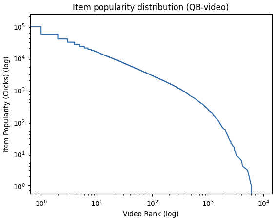
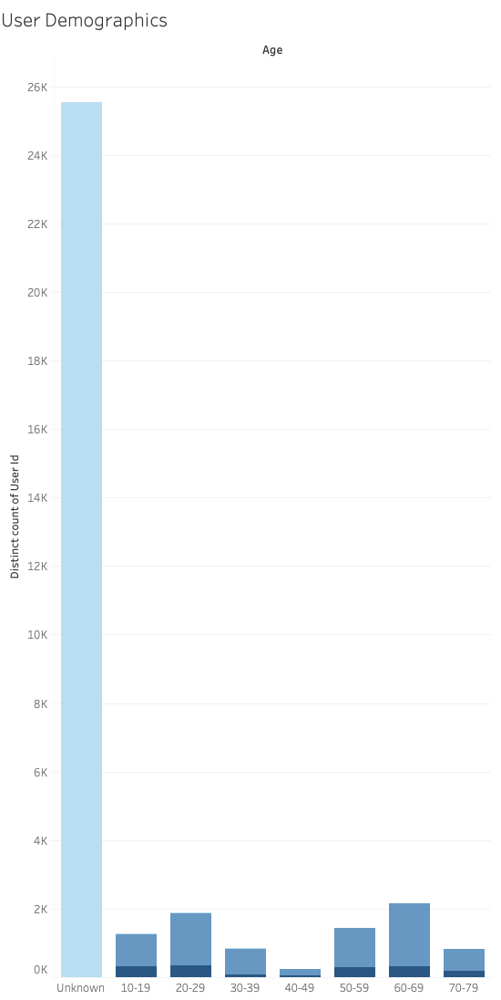
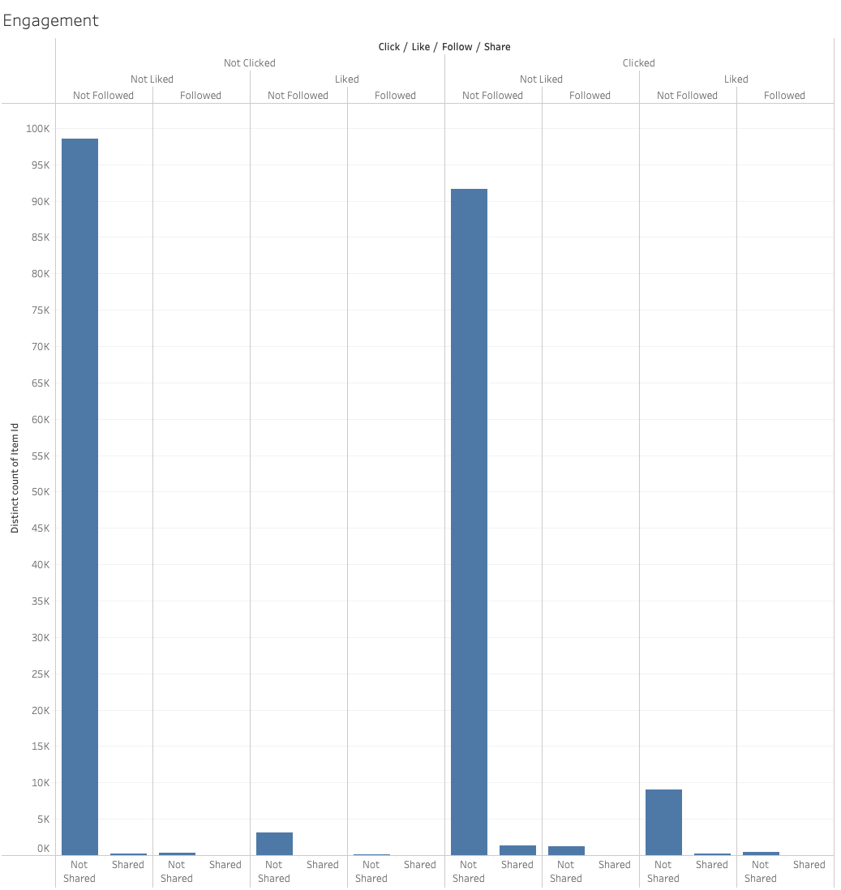

# Exploratory Data Analysis: Tenrec Dataset

I chose a massive dataset taken from anonymized tencent video recommendation apps. The Tenrec dataset comes from a paper published by Yuan et al. in 2023. The dataset is public and available for download at this link: https://github.com/yuangh-x/2022-NIPS-Tenrec

There are many advantages to this dataset. First, it's a real dataset from actual apps, not a synthetic toy dataset. Also, the amount of data is enormous. With over 5 million users and 140 million interactions, it represents a realistic challenge in terms of scale. I decided to focus on the video set, first with the smaller set, called QB-Video. (QK-Video is the larger one)

Actually, QB is from a slightly different, smaller application than QK-Video, but the formatting of both entries are the same.

## What I learned about the Structure
QB-Video includes interaction data from about 30,000 unique users, in the format of:

{user_id, item_id, click, follow, like, share, video_category, watching_times, gender, age}

user_id: unique identifier

item_id: video identifier presented to user

click, follow, like, share are all binary, 0: no action, 1: action

video_category: NULL, 0, 1
    -The category is unknown, for data privacy reasons

watching_times: Number of times the user re-watched the video

Gender: 0, 1, 2
    0: presumed unknown or null,
    1: likely male
    2: likely female

Age: 0 to 7, in bins of 10 years
    0: presumed unknown
    1: 10-19 years old
    2: 20-29 years old
    3: 30-39 years old
    4: 40-49 years old
    5: 50-59 years old
    6: 60-69 years old
    7: 70-79 years old

There are no direct timestamps, again for privacy reasons, but each entry in the table is in sequential order, so we can still get relative temporal data. For example, a single users will have a session of on average around 50 videos, where all have metrics for click, like, follow, share.
## Data Insights
Looking at clicks per video and charting it we can see a typical long-tail distribution.

There are also some missing values, with many users having an unknown gender and age. Many entries in video_category have a null value as well, which I am interpreting as a category of "other".

A huge percentage of viewers have an unknwon age and gender. For users that we know their age, it's much more likely we know the gender. Gender does not have an even split, and there are more users of gender 1 than 2. I'm not sure yet which is male or female, but it doesn't really matter.

Users view videos in a single "session", where they see videos one-by-one. This could lead to some interesting solutions with RNNs which I am excited to explore. The average session length is 71 videos, with 65% of users having a session length of between 0 and 50 videos.

There are some seemingly impossible values, such as videos that were not clicked on, but liked. Or videos that were shared, but now clicked on. Besides those, the ratio of clicked to not clicked for videos is fairly balanced.

## What issues remain?
Handling the large amount of data still remains a challenge. I'm working with the QB-Video dataset which has about 30k users, but I want to eventually use the QK-Video dataset, with 5 million. Designing pipelines and code that is performant, and picking the right libraries to use will be important to consider.

I need to make a decision about videos that were not clicked on, but have been liked or shared. These seem impossible, and there are so few, so my first instict is to remove them. Also, the coarse video categories make me worry that there isn't a huge signal there.

However, a variety of advanced recommenders and classifiers have been evaluated on this dataset, which gives me a good goal to reach for.
