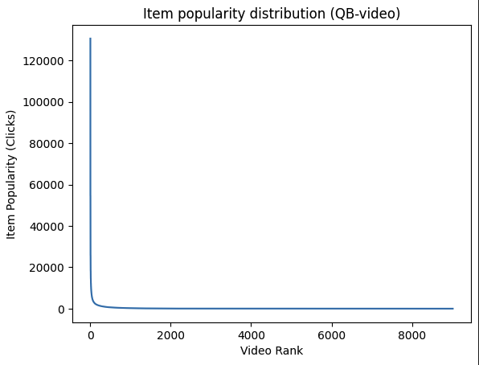
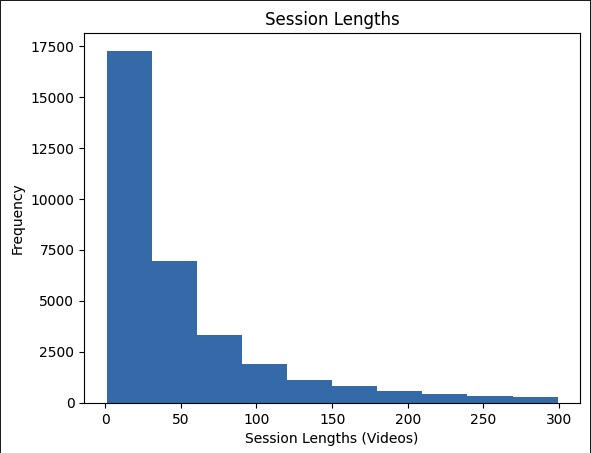

# Session-Based Recommendations with the Tenrec Dataset
Harold Ellis, CSC-466
## The Problem: SBR

Short form sequential content is one of the most relevant and fastest growing parts of the internet today. The engine behind the success of this content is often recognied as the recommendation algorithm, or simply "the algorithm". How are videos recommended to users, and how does recommending to users with session-based recommendations differ from traditional user recommendatoins?

"Sessions" can represent a huge variety of interactions online. From YouTube autoplay, to apps like TikTok, or online shopping suggestions. Sessions are a temporal sequence of information that is used to deliver a recommendation. Often, these sessions are not related to a known user profile and interests change quickly. Each session can almost be treated as a "cold start".

How can we model sequences and generate meaningful recommendations without having information on user tendencies or information on the content of the items we recommend? What tradeoffs does a deep learning approach have when compared to global heuristics, and is it worth the expensive computation?

## The Dataset

To help me better understand SBR, we chose to explore a massive dataset taken from anonymized tencent video recommendation apps. The Tenrec dataset comes from a paper published by Yuan et al. in 2023. The dataset is public and available for download at this link: https://github.com/yuangh-x/2022-NIPS-Tenrec

There are many advantages to this dataset. First, it's a real dataset from actual apps, not a synthetic toy dataset. Also, the amount of data is enormous. With over 5 million users and 140 million interactions, it represents a realistic challenge in terms of scale.
QB-Video includes interaction data from about 30,000 unique users, in the format of:

{user_id, item_id, click, follow, like, share, video_category, watching_times, gender, age}

There are no direct timestamps, again for privacy reasons, but each entry in the table is in sequential order, so we can still get relative temporal data. For example, a single users will have a session of on average around 50 videos, where all have metrics for click, like, follow, share.

## Data Insights
Looking at clicks per video and charting it we can see a typical long-tail distribution.
<div style="display:flex; gap:12px; flex-wrap:wrap;">
  
  
</div>


Users view videos in a single "session", where they see videos one-by-one. This is our "sequence" of which we hope to provide recommendations for. Each user only has a single sequence. Again, with SBR we don't pay much attention to user demographics.




### Evaluation Framework

For the SBR task, we found that features such as gender, age, and watching times would probably be less important in SBR. So, we focused on the item_id (video id), and the click/follow/like/share as metrics of engagement. We created a train/val/test split from the data by withholding the last item in each session for testing, the second to last for validation, and the third to last for the target of training. Then, sessions were capped with a maximum of 30 videos in history, and a minimum of 10 for each model.

### Model Comparisons and Design

First, the random baseline selects a random video and performs extremely poorly. There are roughly 130,000 unique videos, so this is expected to have an extremely low success rate. This model is pretty much useless other than a sign that it's difficult to have any HR@20 or NDCG@20.

Next, we calculated the most popular video by number of clicks and recommended that video for every user. This improved HR@20 and NDCG@20 significantly, so this is likely a better baseline than the random for the deep learning model. This model is extremely underfit, as it only recommends a single video to thousands of different users. However, this model essentially takes zero time to compute and could serve as a simple fallback for more complicated recommendation systems.

For the main deep learning model, we used a embedding layer down to a vector of length 256, concatenating on the features, a two layer unidirectional LSTM with 512 hidden parameters, dropout=0.4, and finally a simple linear layer to all videos in the dataset. Sequences are selected with a minimum length of 10 videos, and a maximum of 30, so the most recent 30 videos are chosen. Shorter videos are left-padded so the last video is always in the same location. The model takes around 5 minutes to train three epochs dataset with ~30k users and ~130k videos on an A100 GPU.

### Results 

As mentioned above, evaluation metrics fall in line to what we expect. Random is essentially useless, popular is better than nothing, and the deep learning approach has some real promise.

```bash
ubuntu@brev-qowxlk8zt:~/tenrec$ uv run eval.py --model random
random HR@20: 0.00%
random NDCG@20: 0.0000

ubuntu@brev-qowxlk8zt:~/tenrec$ uv run eval.py --model gru --checkpoint ./checkpoints/gru_last.pt
gru HR@20: 7.43%
gru NDCG@20: 0.0304

home@Mac tenrec % uv run eval.py --model popular
popular HR@20: 0.74%
popular NDCG@20: 0.0074
```

### Conclusion

Session-based recommendations are what drives many recommendations systems online. With user interests changing mid-session, and users being potentially anonymous, systems have to recommend good content based on sequences only. However, the LSTM architecture provides great recommendations at a reasonable computation cost, especially for inference. The NDCG@20 numbers fall in line with other deep learning approaches on the Tenrec leaderboard.

However, this is not complete. It is impossible to guage user satisfaction from offline testing alone, and metrics such as NDCG do not incentivize "near misses". The best SBR recommendation systems should be tuned with offline and online testing.
